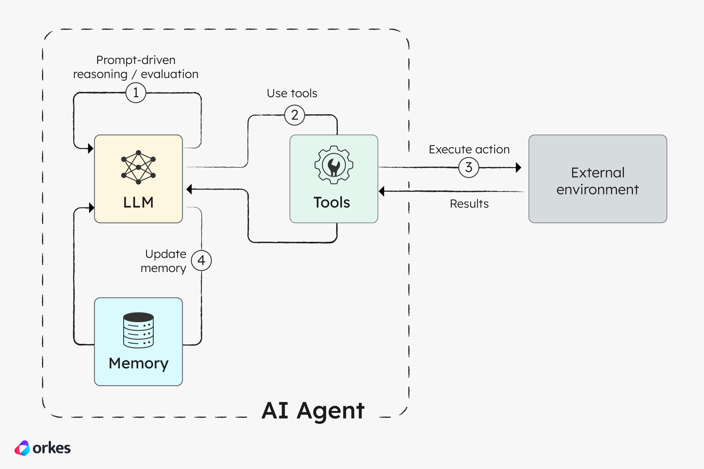
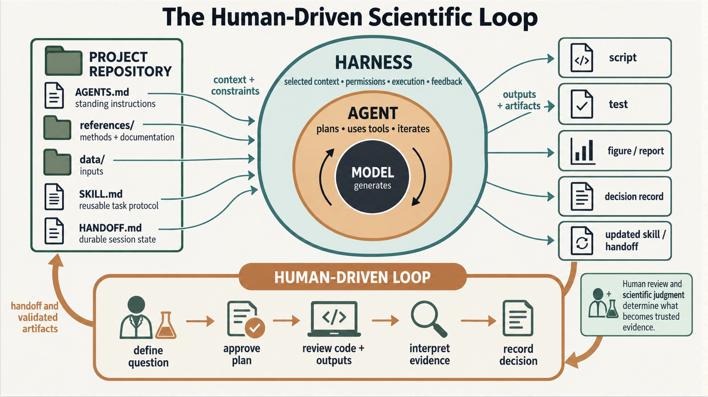
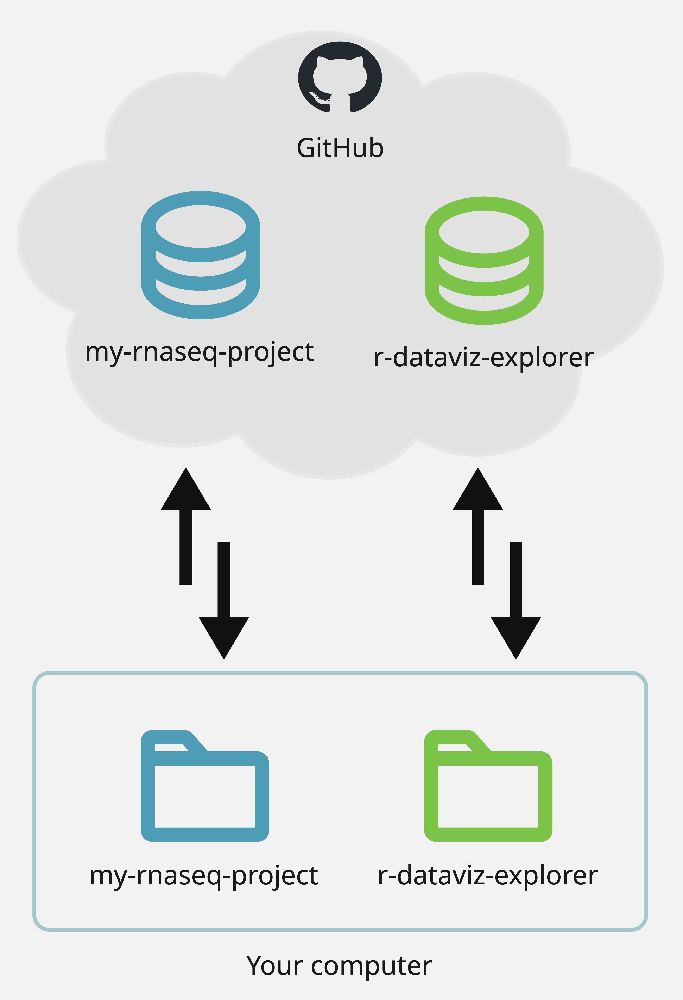
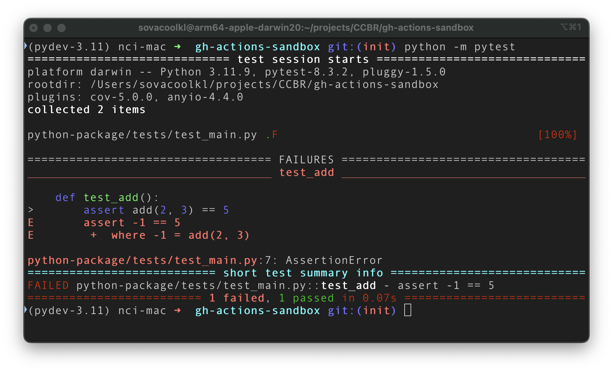
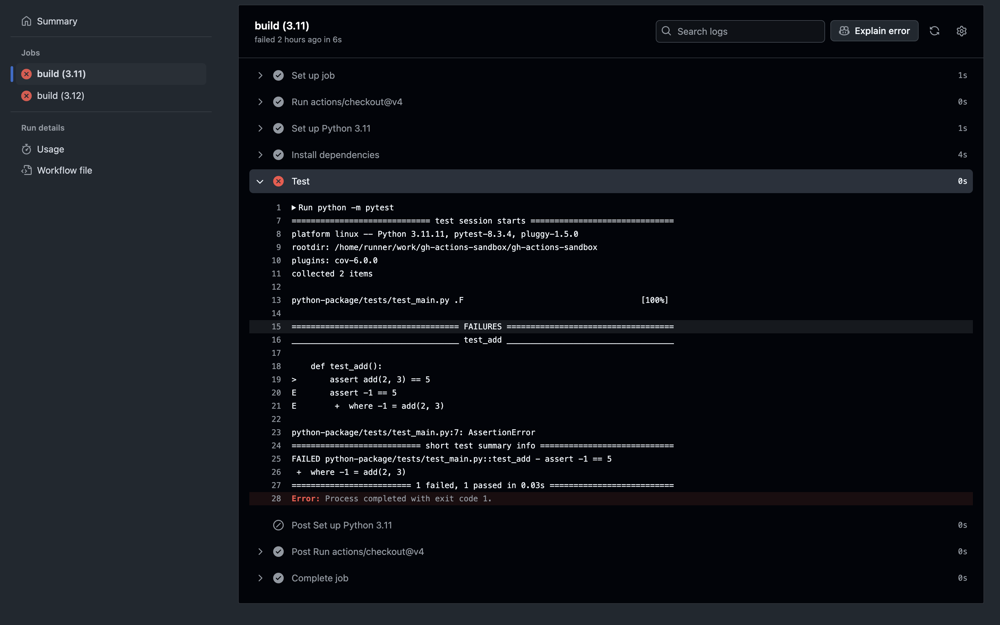
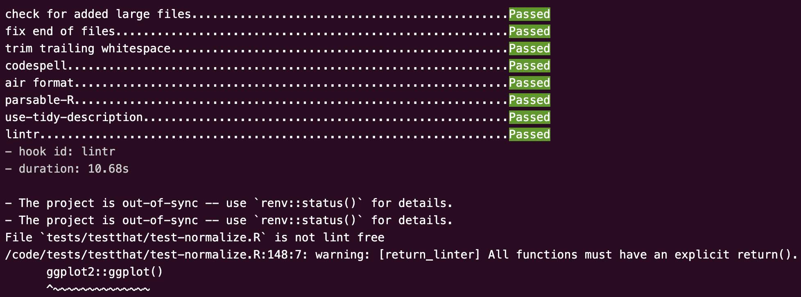
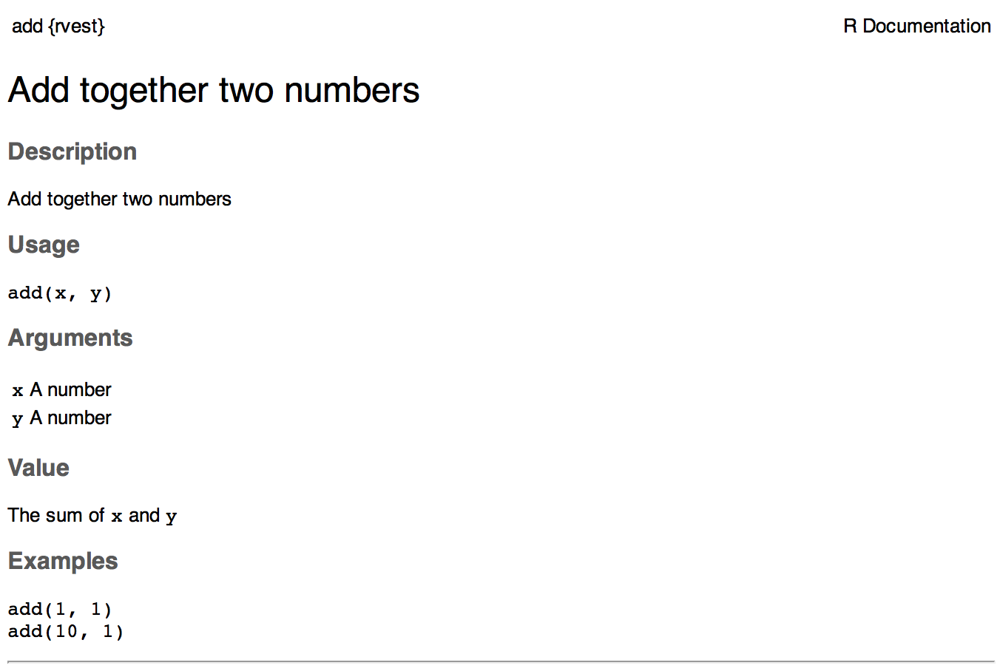
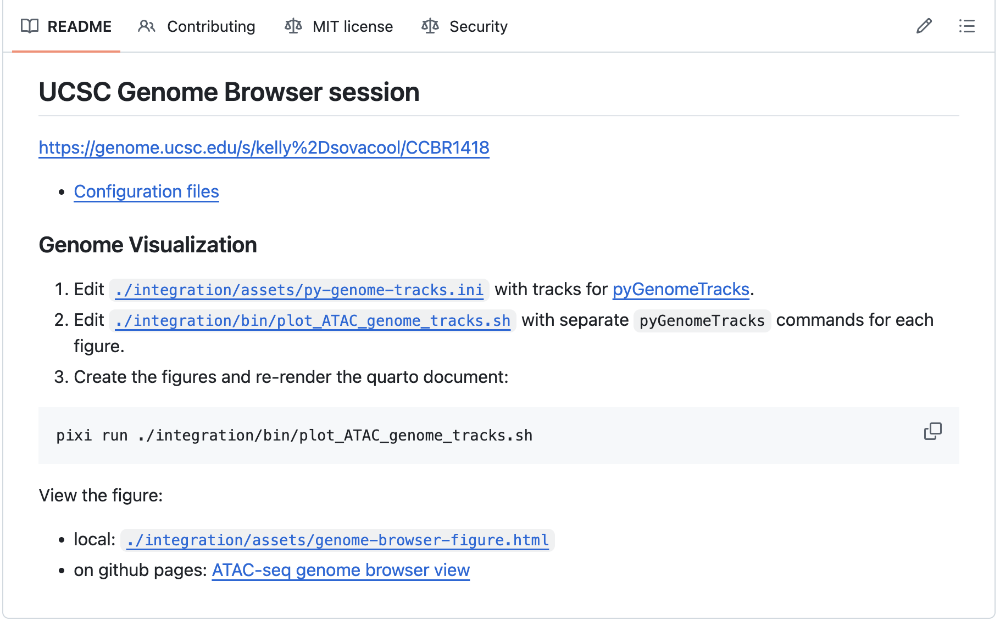
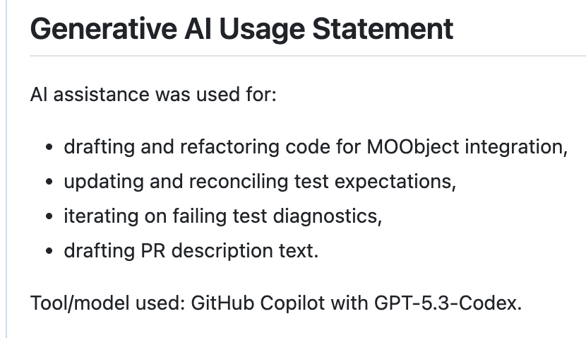

## Bioinformatics is central to biomedical research

:::{.align-center}
{width="80%"}
:::

Audience roles: bioinformatician, computational biologist, data analyst, research software engineer -- **anyone who writes code to analyze biological data**.

::: notes
code quality and correctness is essential for research.
The reproducibility and replicability of data-intensive biological studies
depend on the quality of the software used during data analysis.
:::

## Generative AI has transformed software development {.x-large-text}

:::{.align-center}
{width="80%"}
:::

::: footer
Image: <https://orkes.io/blog/agentic-ai-explained-agents-vs-workflows>
:::

::: {.notes}
TODO very brief into to genAI.
See recent BTEP presentations:
  - [Practical introduction to GenAI](https://bioinformatics.ccr.cancer.gov/btep/classes/a-practical-introduction-to-generative-ai-for-bioinformatics)
  - [From Scripts to Skills: Using Generative AI Without Losing Scientific Control](https://bioinformatics.ccr.cancer.gov/btep/classes/from-scripts-to-skills-using-generative-ai-without-losing-scientific-control)

genAI can be used to assist in a number of tasks, but it is most useful for bioinformaticians when assisting with writing code.
:::

## Generative AI can accelerate bioinformatics

:::{.align-center}
{width="80%"}
:::

:::: {.columns }

::: {.column width="45%" .medium-text}
> ### We can write code faster than ever before
>
> generate new code, troubleshoot bugs, search the web, write tests, execute code
:::

:::{.column width="5%"}
:::

:::{.column width="45%" .medium-text .fragment}
> ### We can write _bad_ code faster, too
>
> unreproducible work, incorrect methods, bugs, inefficiencies, unreadable code, lack of transparency, security vulnerabilities, malware, destructive agent actions
:::

::::

::: {.notes}
Agentic GenAI tools have become especially useful for bioinformatics.

Benefits and Risks of genAI use

- benefits:
  - We can write code faster than ever before. can allow you to do more in the same amount of time.
- risks:
  - We can write _bad_ code faster, too. introduce bugs, wrong scientific results.
  - these risks are true whether a human is writing the code or a genAI agent is doing the writing, the genAI agent just scales it faster.
:::

## Goals for this talk

- Cover the NIH Responsible AI Policy.
- Provide practical tips for minimizing the risks of using genAI for bioinformatics.
- Take-home message: feel empowered to use genAI well and maintain high quality for your work.

## NIH Responsible AI Policy

{width="120%"}

::: footer
Content retrieved September 2026 from
<https://nih.sharepoint.com/sites/NIH-ai/SitePages/Responsible-AI.aspx>
:::

:::{.notes}
Please navigate to the Responsible AI policy page and read it in its entirety.
The NIH Responsible AI policy is a helpful framework to start with.
The policy is for the entire NIH, while the specifics for our individual roles are left to us to figure out.
:::

## NIH AI Use Checklist

::::: {.columns .medium-text}

:::: {.column width="45%" }

:::{.fragment}
### Stop and Reconsider If:
>
> - You cannot verify the output
> - You cannot explain or justify the result
> - The task involves high-stakes decisions without expert review
:::

:::{.fragment}
### 1. Confirm the Use is Appropriate
>
> - Can you clearly state what you need, your audience (e.g., internal, external), and why AI helps?
> - Do you have the time and expertise to review and adapt the output?
> - Are you using a federally approved or authorized tool?
:::

:::{.fragment}
### 2. Define the Human-AI Roles
>
> - What task is the AI performing (e.g., drafting, summarizing, classifying)?
> - What decisions will you make (vs. the AI)?
> - Are you prepared to be accountable for how outputs are used?
:::

::::

::::{.column width="7%"}
::::

:::: {.column width="45%" .medium-text}

:::{.fragment}
### 3. Project Data and Outputs
>
> - Does your input data include clinical, sensitive, identifiable, or restricted information?
> - Is that data allowed in the tool you are using (e.g., consistent with consent, IRB decision, agreements)?
> - Are you sharing only the minimum data necessary?
> - Do the outputs create new sensitivity, intellectual property, or reuse risks?
:::

:::{.fragment}
### 4. Verify Outputs
>
> - Have you checked the facts, numbers, and citations?
> - Have you tested outputs for errors, bias, or omissions?
> - Would you be comfortable defending this output if questioned?
:::

:::{.fragment}
### 5. Be Transparent About AI Use
>
> - Will others know AI was used?
> - Have you documented how outputs were generated (e.g., prompts used)?
> - Have you avoided presenting AI output as authoritative without review?
:::

::::

:::::

::: footer
Content retrieved September 2026 from
<https://nih.sharepoint.com/sites/NIH-ai/SitePages/NIH-AI-Use-Checklist.aspx>
:::

:::{.notes}
The NIH Responsible AI guidance is a helpful framework to start with.
The policy is for the entire NIH, while the specifics for our individual roles are left to us to figure out.

> Can human in the loop solve this problem?
:::

## Human in the loop


::: footer
Image: <https://uvik.net/blog/human-in-the-loop-ai/>
:::

::: notes
Humans review and validate the output of AI tools.

AI is the "driver" of the loop
Cartoon: avalanche of AI approval requests <https://marketoonist.com/2026/03/human-in-the-loop.html>

The problem with human-in-the-loop is the human is responding to the AI output,
rather than being the driving force. Humans must remain in full control.

Another drawback is genAI agents can generate far more output than humans could ever possibly review in a reasonable amount of time.
:::

## Human ~~in~~ driving the loop

::: {.align-center}

:::: {.x-large-text}
A better way: humans judiciously use genAI when appropriate to **support** human-driven tasks.
::::



:::

::: notes
How can genAI assist us in bioinformatics tasks?
:::

## Bioinformaticians design, develop, and execute code {.x-large-text}

:::{.column width="30%" .fragment}
### Design
- Read scientific papers, software documentation, and forums.
- Plan how to analyze data to answer a scientific question.
- Decide how new code will accomplish the analysis plan.
:::

:::{.column width="5%"}
:::

:::{.column width="30%" .fragment}
### Develop
- Write new scripts, packages, and command line tools to accomplish the analysis plan.
- Write tests to validate the the code performs as expected.
- Document how the code works and how it is used to produce results.
:::

:::{.column width="5%"}
:::

:::{.column width="30%" .fragment}
### Execute
- Obtain the data from the study/experiment.
- Install necessary software dependencies.
- Run the code on the data and evaluate the results.
:::

::: {.fragment .align-center}

&nbsp;

#### _How can genAI assist us in bioinformatics tasks?_

Treat GenAI like just another tool in your toolbox.
:::

::: notes
How can genAI assist us in bioinformatics tasks?

TODO insert image/diagram showing tool box with various tools: IDE, terminal, languages, GitHub, GenAI agents
:::

## Practical tips for responsible genAI use

- Follow reproducible practices
- Review, test, and validate all code
- Document everything

## Reproducibility is essential for science {background-gradient="radial-gradient( #A6C7C9, #FFFFFF)"}

:::{.filled-box .align-center}
Yourself ➡️ Future you ➡️ Your collaborators ➡️ Peers in your field
:::

- Can each of the above people run your code on the same dataset and get the same results?
- How difficult would it be for each of them to reproduce your results?

:::{.fragment .align-center}
**You are your own most important collaborator**
:::

## Reproducible practices for responsible AI use

::: {.column}
#### Organize your projects

- One project per directory.
- Keep data, code, and outputs in separate subdirectories.
- Data is read-only; outputs should only be written by the code.

:::

::: {.column}

```
/data/$USER/projects
├── my-rnaseq-project
│   ├── AGENTS.md
│   ├── data/
│   ├── docs/
│   ├── README.md
│   ├── results/
│   ├── scripts/
│   └── tests/
└── r-dataviz-explorer
    ├── references/
    ├── scripts/
    ├── SKILL.md
    └── tests/
```

:::

::: notes
These practices were already essential before genAI use became widespread.
They are even more important now that genAI agents are frequently writing as much or even more code as human developers are.
:::

::: footer
Credit to Samarth Mathur for these project examples.
:::

## Reproducible practices for responsible AI use

::: {.column}
#### Organize your projects

- One project per directory.
- Keep data, code, and outputs in separate subdirectories.
- Data is read-only; outputs should only be written by the code.

#### Version control & backup with git & GitHub

- Create a git repository for each project and upload it to GitHub.
- Commit meaningful code changes and sync with GitHub frequently.
:::

::: {.column}
```
/data/$USER/projects
├── my-rnaseq-project
│   ├── AGENTS.md
│   ├── data/
│   ├── docs/
│   ├── README.md
│   ├── results/
│   ├── scripts/
│   └── tests/
└── r-dataviz-explorer
    ├── references/
    ├── scripts/
    ├── SKILL.md
    └── tests/
```

:::

::: notes
These practices were already essential before genAI use became widespread.
They are even more important now that genAI agents are frequently writing as much or even more code as human developers are.
:::

::: footer
Credit to Samarth Mathur for these project examples.
:::
## Reproducible practices for responsible AI use

::: {.column}
#### Organize your projects

- One project per directory.
- Keep data, code, and outputs in separate subdirectories.
- Data is read-only; outputs should only be written by the code.

#### Version control & backup with git & GitHub

- Create a git repository for each project and upload it to GitHub.
- Commit meaningful code changes and sync with GitHub frequently.
:::

::: {.column .align-right}

{width="75%"}

:::

::: notes
These practices were already essential before genAI use became widespread.
They are even more important now that genAI agents are frequently writing as much or even more code as human developers are.

TODO show how/why this practice helps reduce risks. version control example of giving too much control to agent and it deletes important code.
:::

::: footer
Credit to Samarth Mathur for these project examples.
:::

## Review, test, and validate

From the NIH Responsible AI policy:

> Do not rely on the technology to be a software developer by proxy:
>
> - All well-written code must adhere to security design and ethical principles.
> - All code output needs to be reviewed for completeness, quality, efficiency, and, most of all, security.
> - Leverage manual and automated validation tools and testing technologies to help ensure these factors.
> - If you cannot identify or understand what a piece of AI generated code does, you should not use it.

_AI outputs may be incomplete, inaccurate, biased, or fabricated._

::: footer
Content retrieved September 2026 from
<https://nih.sharepoint.com/sites/NIH-ai/SitePages/Responsible-AI.aspx>
:::

## Review

- Read the entire output of each genAI prompt and ensure you understand it.
- Be skeptical. Do not blindly trust that the output is complete or correct.
- Treat genAI like an untrustworthy stranger.
  - Do not expose passwords or sensitive information.

::: notes
:::

## Review

:::{.column}
> If you cannot identify or understand what a piece of AI generated code does, you should not use it.
:::

:::{.column}
If you do not understand a piece of AI-generated code, dig into the documentation and tutorials to **learn how it works**.
:::

:::{.fragment}
- Come across a **package or function** you've never seen? Find the documentation and learn how it works
  - R: use `?` and `help()`. Python: use `help()`
  - Docs websites: <https://rdrr.io/>, <https://docs.python.org/3/>
- Come across a **large chunk of code** with many patterns you don't understand?
  - Prompt the genAI agent to explain it line-by-line. Verify the explanation by asking for sources and reading them.
- Use forums for in-depth help from people.
  - StackOverflow, biostars, Posit forum, GitHub discussions
:::

::: notes
treat it as a learning opportunity
:::

## Testing & validadtion

Write tests to make sure the code behaves as expected.

- Unit tests for individual functions on trivial inputs/data.
- Integration tests run multiple functions or even an entire analysis on small & simulated datasets.
- R: testthat. Python: pytest, unittest

:::{.column width="30%"}
```
my-python-project
├── data/
├── src/mypackage
│   └── main.py
└── tests
    └── test_main.py
```
:::

:::{.column width="10%"}
:::

:::{.column width="50%" .medium-text}
```{.python filename="src/mypackage/main.py"}
def gc_content(seq):
    """Fraction of G/C bases in a DNA sequence."""
    seq = seq.upper()
    return (seq.count("G") + seq.count("C")) / len(seq)
```

&nbsp;

```{.python filename="tests/test_main.py"}
from mypackage.main import gc_content

def test_gc_content():
    assert gc_content("GGCC") == 1.0
    assert gc_content("ATAT") == 0.0
    assert gc_content("atgc") == 0.5
```
:::

## Testing & validadtion

:::{.column}
Run tests before accepting code.


:::
:::{.column}
Use GitHub actions to automate.


:::

::: notes
detect problems and bugs sooner
:::

## Testing & validadtion

:::{.column width="45%"}
Use linters and code quality checks.

- Ensure code is formatted for readability, quality, and syntax is correct.
- Security and vulnerability scanning with GitHub Advanced Security.
- R: air. Python: ruff.
:::

:::{.column width="5%"}
:::

:::{.column width="45%"}
Use `pre-commit` to run checks automatically on every change.


:::


## Document everything

Inline comments, function docstrings, vignettes, tutorials, getting started guide

:::{.column width="45%"}
```{r}
#| eval: false
#| echo: true
#| filename: "Rscript"

#' Add together two numbers
#'
#' @param x A number
#' @param y A number
#' @returns The sum of `x` and `y`
#' @examples
#' add(1, 1)
#' add(10, 1)
add <- function(x, y) {
  x + y
}
```

:::: fragment
{.align-center}
::::

:::

:::{.column width="3%"}
:::

:::{.column width="52%"}
{.fragment .align-center}
:::

::: footer
:::

## Document how you are using GenAI {.x-large-text}

:::{.align-center}

> from the very beginning of the project:

:::

::: {.column width="48%"}

Create a document outlining how you will and will _not_ use GenAI.

```{md}
#| filename: "docs/ai-usage.md"
#| echo: true

- Human responsibilities: Formulate the problem statement,
  design the software,
  validate the results, write the interpretation.
- GenAI roles: assist in generating code, unit tests,
  and function documentation.
```

:::

::: {.column width="4%"}
:::

::: {.column width="48%" .fragment}

Disclose use of GenAI in commit messages, issue comments, and pull requests.

{width="80%"}

:::

::: notes
Disclosing your use of GenAI is transparent and maintains trust and credibility in your work.
:::

## Responsible genAI use to maximize benefits, minimize risks

| Tip    | Risks minimized   |
|--------|-------------------|
| Follow reproducible practices       | unreproducible work, destructive agent actions |
| Review, test, and validate all code | incorrect methods, bugs, inefficiencies, malware |
| Document everything                 | unreadable code, unusable code, lack of transparency |

::: notes
:::

## Final reminders

- Generative AI tools use statistical models to produce outputs that look like a plausible response to a prompt.  🦜
  - View GenAI as another tool in your toolbox alongside IDEs, HPCs, and other software.
  - Interpreting the meaning of AI outputs is your responsibility. Treat it as a learning experience!
- AI tools can accelerate bioinformatics. 🚀
  - Just make sure you're facing the direction you want to go!

::: notes
TODO image
:::

## Resources

- Related talks:
  - [Practical introduction to GenAI](https://bioinformatics.ccr.cancer.gov/btep/classes/a-practical-introduction-to-generative-ai-for-bioinformatics) - BTEP
  - [From Scripts to Skills: Using Generative AI Without Losing Scientific Control](https://bioinformatics.ccr.cancer.gov/btep/classes/from-scripts-to-skills-using-generative-ai-without-losing-scientific-control) - BTEP
  - [Organizing and documenting NGS pipelines on GitHub](https://bioinfo-abcc.ncifcrf.gov/training/event/organizing-and-documenting-ngs-pipelines-on-github-building-549-executive-board-room-nci-frederick-1204241200) - ABCS Programmer's Corner
- [NIH Guidelines for Responsible AI](https://nih.sharepoint.com/sites/NIH-ai/SitePages/Responsible-AI.aspx)
- Tutorial: [GitHub Copilot in VS Code](https://ccbr.github.io/HowTos/docs/generative-AI/gh-pilot-vs-code/)
- [GitHub Copilot in VS Code cheat sheet](https://code.visualstudio.com/docs/copilot/reference/copilot-vscode-features)

::: {.notes}
- TODO link to github for nih
:::
